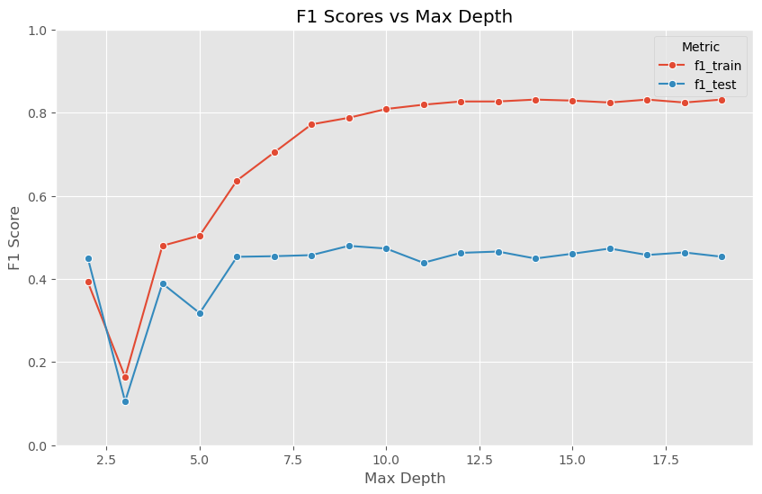
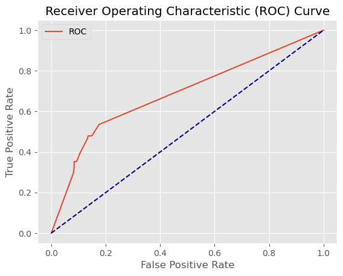

# 02 - Decision Tree

## What is a Decision Tree?
A Decision Tree splits the data into subsets based on feature thresholds, creating a tree-like structure of decisions. At each node, the algorithm picks the feature and split point that best separates the classes (using Gini impurity or Entropy). It continues splitting until it reaches a stopping condition, such as a maximum depth or a minimum number of samples per leaf.

The result is a highly interpretable model — you can literally follow the branches to understand why a prediction was made.

## When to use Decision Trees
- When interpretability is important — easy to explain to non-technical stakeholders
- When you have mixed data types (numerical and categorical)
- As a building block for ensemble methods (Random Forest, AdaBoost, Gradient Boosting)
- When you want a quick baseline without scaling

## Limitations
- Prone to overfitting — trees can grow very deep and memorize the training data
- Sensitive to small changes in data — a slightly different split can produce a very different tree
- Struggles with class imbalance
- A single tree rarely achieves state-of-the-art performance — ensembles are usually better

## Results

| Metric | Train | Test |
|--------|-------|------|
| F1 Score | 0.85 | 0.44 |
| AUC | - | 0.69 |

## What we found
A big improvement over KNN — test F1 jumped from 0.22 to 0.44 and AUC from 0.54 to 0.69. However, overfitting was clear with train F1 at 0.85. GridSearchCV found the best params at `criterion=entropy, max_depth=50` — but the parameter analysis revealed that test F1 actually peaks around depth 9-10 and flattens after that, while train keeps climbing.

Key observations:
- **max_depth** had the biggest impact — deeper trees overfit heavily
- **min_samples_split** had almost zero effect on this dataset — completely flat curves
- **min_samples_leaf** helped close the train/test gap at larger values

## Plots

### F1 Score vs Max Depth

Test F1 peaks around depth 9-10, then flattens, while train keeps climbing to 0.83 — a textbook overfitting pattern.

### ROC Curve

AUC of 0.69 — a solid improvement
