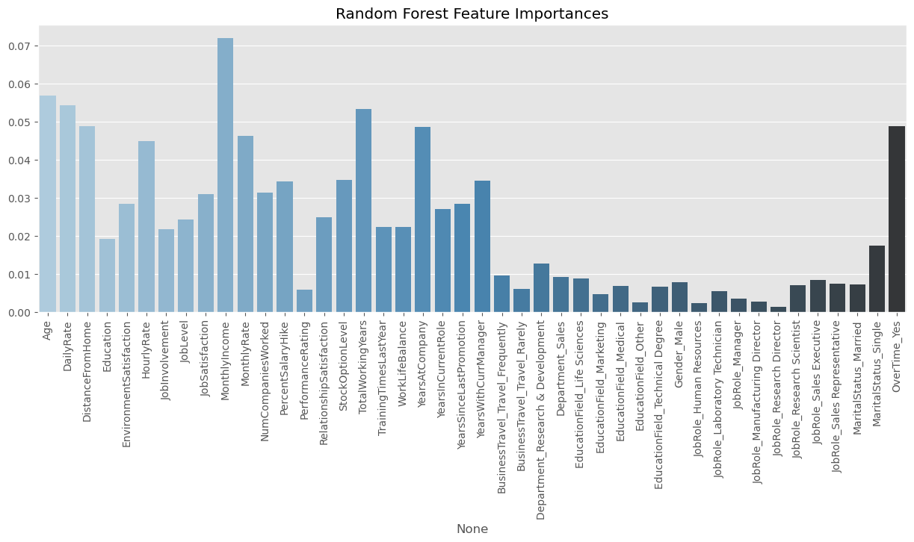
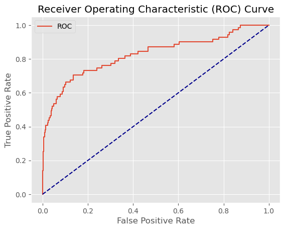

# 07 - Ensemble Methods

## What are Ensemble Methods?
Ensemble methods combine multiple models to produce better predictions than any single model alone. There are two main strategies:

- **Bagging** (Bootstrap Aggregating): trains multiple models independently on random subsets of the data and averages their predictions. Reduces variance and overfitting. Random Forest is the classic example.
- **Boosting**: trains models sequentially, where each new model focuses on correcting the errors of the previous one. Reduces bias. AdaBoost and Gradient Boosting are classic examples.

> Note: Bagging and Boosting are not restricted to trees — any base estimator can be used as a weak learner.

## When to use Ensemble Methods
- When a single model overfits or underfits consistently
- When you want to squeeze out extra performance beyond linear models
- Random Forest is a great default first ensemble to try
- Gradient Boosting tends to win on tabular data competitions
- When you have enough compute, ensembles are slower to train

## Limitations
- Less interpretable than single models — harder to explain predictions
- Slower to train and predict than simple models
- More hyperparameters to tune
- Can still overfit on small imbalanced datasets like this one
- Boosting methods are sensitive to noisy data and outliers

## Results

### Random Forest
| Metric | Train | Test |
|--------|-------|------|
| F1 Score | 0.98 | 0.31 |
| AUC | - | 0.82 |

### AdaBoost
| Metric | Train | Test |
|--------|-------|------|
| F1 Score | 0.58 | 0.55 |
| AUC | - | 0.83 |

### Gradient Boosting
| Metric | Train | Test |
|--------|-------|------|
| F1 Score | 1.00 | 0.48 |
| AUC | - | N/A |

## What we found
Ensemble methods were surprisingly disappointing on this dataset — none of them beat Logistic Regression. Random Forest and Gradient Boosting both severely overfit (train F1 ~1.0), while AdaBoost was the most balanced, with train F1 of 0.58 and test F1 of 0.55.

Key observations:
- **AdaBoost was the best ensemble** — sequential boosting handled the class imbalance better than bagging
- **Random Forest top features**: MonthlyIncome, Age, DailyRate — continuous variables dominated, unlike Logistic Regression, where OverTime_Yes was king
- **Gradient Boosting overfitted badly** — high learning rate with few estimators memorized the training data
- **Class imbalance is the real problem** — techniques like SMOTE or class weighting could significantly improve all ensemble methods

## Plots

### Random Forest Feature Importances

MonthlyIncome dominates as the top feature, followed by Age and DailyRate. Interestingly, this contrasts with Logistic Regression, in which OverTime_Yes was the strongest predictor—different models highlight different aspects of the data.

### AdaBoost ROC Curve

AUC of 0.83 — best among the ensemble methods, but still below Logistic Regression and SVM.
