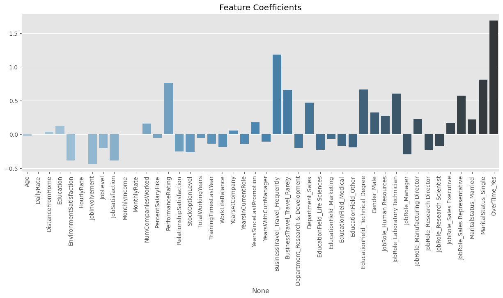
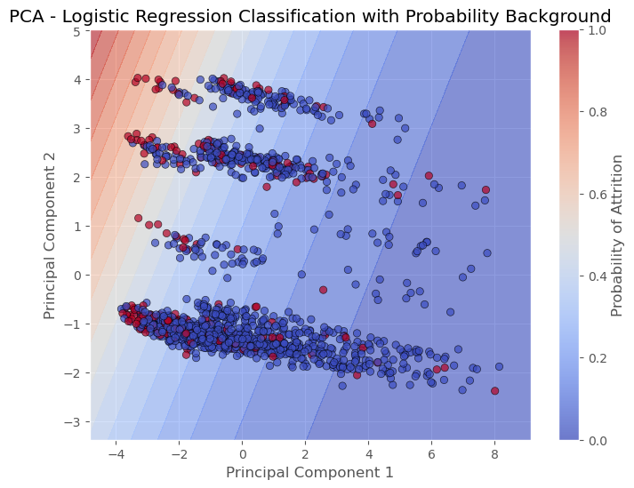
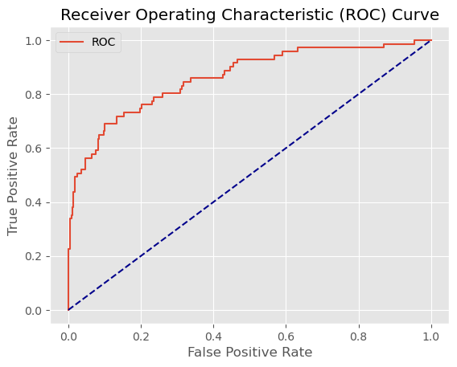

# 04 - Logistic Regression

## What is Logistic Regression?
Despite the name, Logistic Regression is a classification algorithm. It models the probability of a class using a logistic (sigmoid) function, which squashes any input into a value between 0 and 1. It draws a linear decision boundary in the feature space and is one of the most widely used classifiers in industry.

The key hyperparameter is **C** — the inverse of regularization strength. Small C = more regularization, large C = less regularization.

## When to use Logistic Regression
- When you need an interpretable model with clear feature importance via coefficients
- When the relationship between features and target is roughly linear
- As a strong baseline before trying complex models
- When you need probability outputs that are well calibrated
- When training speed matters — it's very fast even on large datasets

## Limitations
- Assumes a linear decision boundary — struggles with complex non-linear patterns
- Sensitive to correlated features — coefficients can be unstable
- Requires feature scaling for best performance
- Not great with very high-dimensional sparse data without regularization

## Results

| Metric | Train | Test |
|--------|-------|------|
| F1 Score | 0.57 | 0.61 |
| AUC | - | 0.86 |

## What we found
Logistic Regression was the star of this project — best F1 and best AUC by a significant margin. Interestingly, test F1 (0.61) was slightly higher than train F1 (0.57), meaning the model generalizes perfectly with no overfitting. GridSearchCV found the best params at `C=1, penalty=l2`.

Key observations:
- **No overfitting** — Logistic Regression generalizes better than any other model in this project
- **AUC=0.86** — a huge jump from Naive Bayes (0.74)
- **OverTime_Yes** was by far the strongest predictor of attrition
- **BusinessTravel_Frequently** and **MaritalStatus_Single** also strongly increase attrition risk
- **JobLevel** and **JobInvolvement** are protective — higher levels and more engaged employees tend to stay

## Plots

### Feature Coefficients

OverTime_Yes dominates with a coefficient of ~1.7. Continuous features like MonthlyIncome have near-zero coefficients — the model relies more on categorical indicators.

### PCA Decision Boundary

The linear decision boundary is sharper and more confident compared to Naive Bayes, with a smoother probability gradient reflecting the stronger AUC.

### ROC Curve

AUC of 0.86 — the best result in the entire project.
