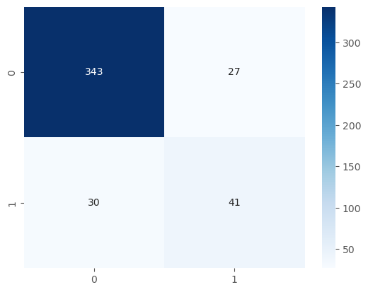
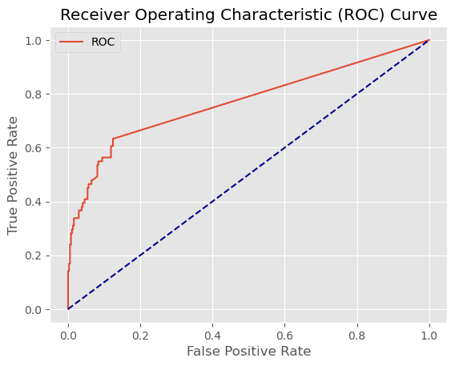

# 06 - Multi-Layer Perceptron (MLP)

## What is an MLP?
A Multi-Layer Perceptron is a feedforward neural network made up of layers of neurons. Each neuron takes a weighted sum of its inputs, applies an activation function, and passes the result to the next layer. The network learns by adjusting weights through backpropagation — minimizing the error between predictions and true labels.

Key hyperparameters:
- **hidden_layer_sizes**: number of layers and neurons per layer
- **activation**: the non-linear function applied at each neuron (relu, tanh, logistic)
- **alpha**: L2 regularization strength
- **solver**: optimization algorithm (sgd, adam, lbfgs)

## When to use MLP
- When you have large amounts of data — neural networks shine at scale
- When the relationship between features and target is highly non-linear
- When you have the compute resources to tune architecture and hyperparameters
- Image, audio, and text tasks where deep learning excels

## Limitations
- Requires a lot of data to generalize well — struggles on small datasets like this one
- Many hyperparameters to tune — architecture, learning rate, regularization, solver
- Prone to overfitting without careful regularization
- Acts as a black box — no direct feature importance
- Sensitive to feature scaling — always normalize your data
- Training can be slow and unstable depending on the solver

## Results

| Metric | Train | Test |
|--------|-------|------|
| F1 Score | 0.84 | 0.59 |
| AUC | - | 0.77 |

## What we found
Despite being a neural network, MLP underperformed compared to Logistic Regression and SVM. The small network architecture (5,3,2) overfit heavily — train F1 of 0.84 vs test F1 of 0.59. AUC of 0.77 was a step back from the linear models.

Key observations:
- **Overfitting** — the small network memorizes the training set despite regularization
- **alpha=10 collapsed the model** — too much regularization prevented any learning, F1 dropped to 0
- **Dataset size is the bottleneck** — with only 1,470 samples, simpler models generalize better than neural networks
- A larger network or more data could potentially push performance higher

## Plots

### Confusion Matrix

The model catches some attrition cases but still misses a significant portion of the minority class.

### ROC Curve

AUC of 0.77 — below the linear models but better than Decision Tree and Naive Bayes.
