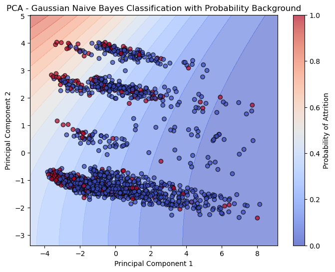
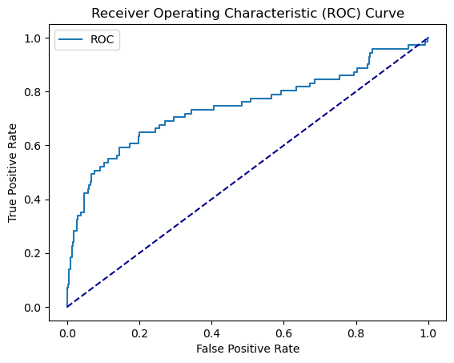

# 03 - Naive Bayes

## What is Naive Bayes?
Naive Bayes is a probabilistic classifier based on Bayes' theorem. It calculates the probability of each class given the input features and picks the most likely one. The "naive" part comes from the assumption that all features are independent of each other — which is rarely true in real life, but works surprisingly well in practice.

We used **Gaussian Naive Bayes** here, which assumes that the continuous features follow a normal distribution.

## When to use Naive Bayes
- When you need a fast, lightweight baseline
- When training data is limited — it estimates probabilities efficiently
- When features are roughly independent
- Text classification and spam filtering are classic use cases
- When you want a model with no overfitting risk

## Limitations
- The independence assumption is almost always violated in real data
- Can't capture interactions between features
- Sensitive to features that don't follow a Gaussian distribution
- Not great with highly correlated features like MonthlyIncome and JobLevel

## Results

| Metric | Train | Test |
|--------|-------|------|
| F1 Score | 0.44 | 0.44 |
| AUC | - | 0.74 |

## What we found
Naive Bayes delivered a surprising result — train and test F1 are virtually identical at 0.44, meaning zero overfitting. The strong independence assumption acts as a natural regularizer. AUC of 0.74 was the best at this point in the project, beating both KNN and Decision Tree.

Key observations:
- **No overfitting at all** — the model generalizes by design
- **AUC beats Decision Tree** despite a simpler model — a good reminder that complexity doesn't always win
- **Fast training** — no optimization procedure, just probability estimation

## Plots

### PCA Decision Boundary

Reducing to 2 PCA components reveals three horizontal clusters in the data, likely driven by department or job level. Attrition cases concentrate on the left side of the feature space where the probability background is warmer.

### ROC Curve

AUC of 0.74 — best result so far at this stage of the project.
