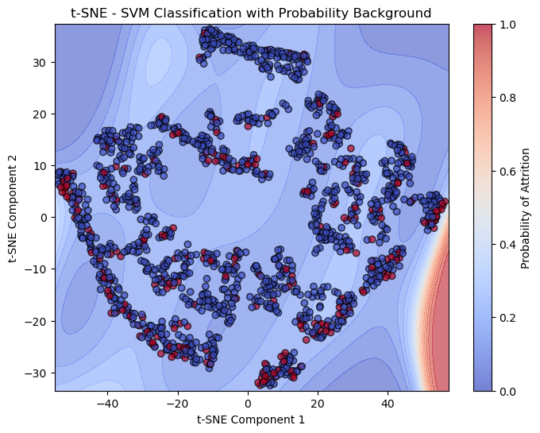
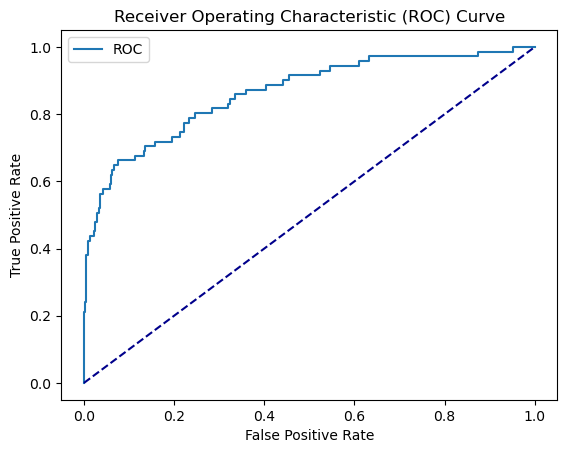

# 05 - Support Vector Machine (SVM)

## What is SVM?
A Support Vector Machine finds the optimal hyperplane that separates classes by maximizing the margin between the closest data points of each class (called support vectors). It can handle non-linear boundaries through the **kernel trick** — projecting data into a higher-dimensional space where it becomes linearly separable.

Key hyperparameters:
- **C**: penalty for misclassification — higher C = less regularization
- **kernel**: the function used to transform the data (linear, rbf, poly, sigmoid)
- **gamma**: controls the influence of individual training points

## When to use SVM
- When you have a clear margin of separation between classes
- When the number of features is high relative to the number of samples
- When you need a robust model that works well out of the box with scaling
- Effective in text classification and image recognition tasks

## Limitations
- Slow to train on large datasets — doesn't scale well
- Sensitive to feature scaling — always normalize your data
- Hard to interpret — no direct feature importance like Logistic Regression
- Kernel and hyperparameter choice can be tricky
- Doesn't naturally output well-calibrated probabilities (needs `probability=True`)

## Results

| Metric | Train | Test |
|--------|-------|------|
| F1 Score | 0.55 | 0.60 |
| AUC | - | 0.86 |

## What we found
SVM matched Logistic Regression almost exactly — same AUC of 0.86 and very similar F1 scores. The linear kernel won the GridSearch, which makes sense given that Logistic Regression (also a linear model) performed so well. The RBF kernel completely failed with gamma=1 — too aggressive for this dataset.

Key observations:
- **Linear kernel won** — confirms the data is largely linearly separable
- **RBF with gamma=1 scored 0.0** — gamma needs to be much smaller for scaled data
- **No overfitting** — test F1 slightly higher than train, just like Logistic Regression
- SVM and Logistic Regression converging to the same result suggests a linear boundary is the right approach here

## Plots

### t-SNE Decision Boundary

Unlike the PCA plots in previous notebooks, t-SNE reveals the true complexity of the data — a ring-like structure with attrition cases scattered throughout all clusters. This explains why no model has been able to push F1 significantly above 0.60.

### ROC Curve

AUC of 0.86 — tied with Logistic Regression for best in the project.
